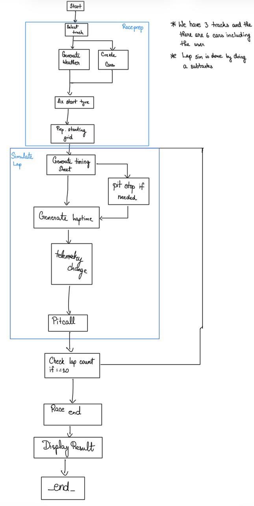

# Overview of MAT496

In this course, we have primarily learned Langgraph. This is helpful tool to build apps which can process unstructured `text`, find information we are looking for, and present the format we choose. Some specific topics we have covered are:

- Prompting
- Structured Output 
- Semantic Search
- Retreaval Augmented Generation (RAG)
- Tool calling LLMs & MCP
- Langgraph: State, Nodes, Graph

We also learned that Langsmith is a nice tool for debugging Langgraph codes.

------
# Capstone Project objective

The first purpose of the capstone project is to give a chance to revise all the major above listed topics. The second purpose of the capstone is to show your creativity. Think about all the problems which you can not have solved earlier, but are not possible to solve with the concepts learned in this course. For example, We can use LLM to analyse all kinds of news: sports news, financial news, political news. Another example, we can use LLMs to build a legal assistant. Pretty much anything which requires lots of reading, can be outsourced to LLMs. Let your imagination run free.

------

## Title: F1 Race Strategy Simulator

## Overview

This project is an F1 race simulator designed to model complex race scenarios. It utilizes Langgraph to simulate strategic decisions, factoring in variables such as tyre degradation, weather conditions, and pit stop timing to predict potential race outcomes.

## Reason for picking up this project

I selected this project to merge my deep-seated interest in the  world of Formula 1 strategy with the advanced LLM concepts 
mastered in this course. 
The dynamic nature of an F1 race—where split-second decisions on tyres, pit stops, and defending against rivals can 
determine the outcome—provides a rich, complex environment to challenge my critical thinking and strategic modeling abilities.

Beyond just applying standard techniques, this project aims to push the boundaries of 
how we can model such dynamic systems. It comprehensively employs Langgraph for managing the evolving 
race state, RAG to leverage vast historical data for context-aware simulations, graph parallelization 
to model competing team strategies concurrently, and human-in-the-loop interrupts for those crucial, 
race-defining moments. Tackling this level of complexity makes it a deeply engaging and rewarding endeavor.

## Plan

### Flow of Control

I plan to excecute these steps to complete my project.

- Step 1: LangGraph State & Initialization

  - Define the global AgentState (tracking current lap, max laps=20, weather, and tyre status for user + 5 AI cars).
  - Define the states for the telemetry, race_engineer, etc.
  - Create the setup_race node: Simple inputs for Track Selection (3 options) and Starting Tyre.
  - Implement a basic LLM call to generate_weather and store it in the state.

- Step 2: The Simulation Loop (approx. 5 hrs)

  - Build the simulate_lap node: This is the core calculation engine. It must update tyre degradation and calculate lap times for all 6 cars based on current weather and tyre age.
  - Implement the loop logic: Ensure the graph cycles 20 times before exiting to a race_end node.

- Step 3: Basic Telemetry Output (approx. 4 hrs)

  - Create a timing_sheet node that runs after every lap to display the current leaderboard in the console/UI.
  - Milestone 1 complete: A non-interactive race that runs from lap 1 to 20 automatically.

- Step 4: Human-in-the-loop Pit Stops (approx. 6 hrs)

  - Implement a conditional edge after each lap to check if a pit stop is viable (e.g., tyre health < 30%).
  - Add a LangGraph interrupt allowing the user to choose "Box" or "Stay out".
  - Create the pit_stop_handler node: Resets tyre health and adds 5-10s delta to the user's total race time.
  - Add an LLM tool call here that analyzes current telemetry and advises the user on whether to pit.

- Step 5: AI Competitor Logic (approx. 4 hrs)

  - Update the simulate_lap node to allow the 5 AI cars to follow fixed, pre-determined strategies (e.g., AI Car 1 always pits on Lap 10).

- Step 6: Testing & Documentation (approx. 2 hrs)

  - Final debugging of edge cases (e.g., pitting on the final lap).

## Conclusion:

I had planned to achieve {this this}. I think I have/have-not achieved the conclusion satisfactorily. The reason for your satisfaction/unsatisfaction.
----------

  